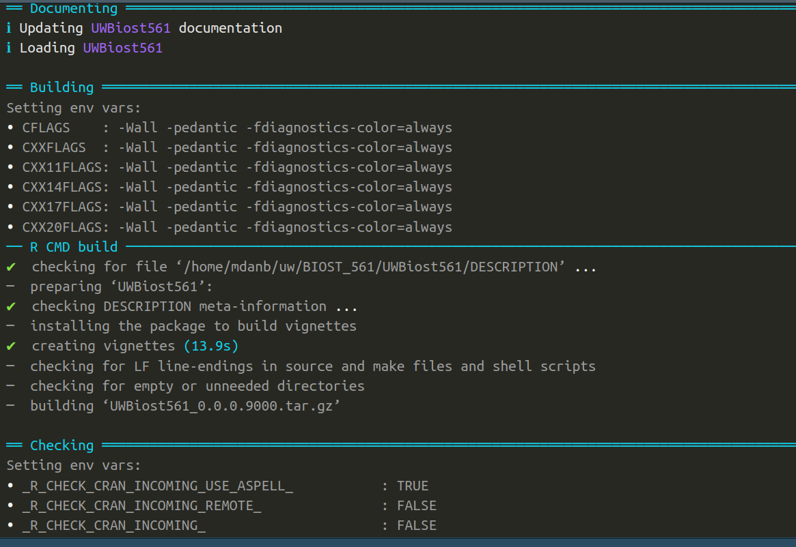

```{r setup, include = FALSE}
knitr::opts_chunk$set(
  collapse = TRUE,
  comment = "#>"
)
set.seed(10)
```

# Instructions

These instructions are essential, so please read them all carefully. 

- Submit your homework on your GitHub page as the RMarkdown (`.Rmd`) and HTML files. 

- Please answer the question prompt and show your code (inline). That is,
all your code should be visible in the knitted chunks.

- To complete this homework, you may write in the `HW3.Rmd` file. 
(It is recommended to complete this homework in R Studio, where clicking the
`Knit` button would knit your homework.)

# Disclosures

- Please disclose below who you collaborated with and if you've used ChatGPT (or any
comparable AI tool) to what extent when completing this homework. See the syllabus
for the course expectations.

(Note: This homework is substantially more challenging than Homework 2
since this homework is much more open-ended.
If you feel stuck in this homework,
feel free to consult ChatGPT. ChatGPT can give you strategies for tackling a problem, code on how to tackle the problem, and an explanation
of how each step of the code works.
Try using ChatGPT as part of your workflow.
This homework will get you to realize that writing "code that gets the job done" (while important)
is only a tiny part of what it means to "be a strong coder.")

<span style="color:red">
I used ChatGPT to create the `generate_partial_clique()` and `compute_maximal_partial_clique()` functions and documentation. 
</span>

# Note about the homework

**Note**: Most of your R code for this homework will **not** be in this homework.
You mainly write `.R` files inside the `R` or `tests` folders.
Therefore, you only need to show a little code inside this R Markdown file.
You only need to write things inside this R Markdown file in the questions that explicitly ask you to do so.

# Q1: Designing a function to generate random graphs with partial cliques

<mark>**Intent**: The intent of this question is: 1) to give you practice putting
R functions into your `UWBiost561` package, and 2) to help you create ways to test your function in Question 3 below meaningfully.</mark>

Recall the `generate_random_graph()` function that you used in Homework 2. 

```{r}
source("https://raw.githubusercontent.com/linnykos/561_s2025_public/main/HW2_files/random_graph_functions.R")
generate_random_graph
```

Your (deliberately open-ended) goal in this question is to design a function
`generate_partial_clique()` that generates a random adjacency matrix 
with a large **partial** clique, not necessarily a (fully connected) clique. 

<u>**Question 1A**</u>: Create a function `generate_partial_clique()`
inside your `UWBiost561` package inside a file called `generate_partial_clique.R`
inside your `R` folder. 
<span style="color: blue;">(There is nothing to report for this question. Your code will be in the `R` folder, **not**
in this R Markdown file.)</span>

<mark>**Specifications on your function overall**:</mark>

1. Your function **must** be called `generate_partial_clique`.
2. Your function **must** be in a file called `generate_partial_clique.R` in the `R` folder within your `UWBiost561` package.
3. If you write additional "helper" functions that `generate_partial_clique()` depends on, **all** your additional functions must also be in `generate_partial_clique.R`. That is,
`generate_partial_clique.R` should be "self-contained."
4. Your code must only be written in R. (You cannot write code in C++, Java, or Python.)


<mark>**Specifications of your function inputs**:</mark>

1. The first, second, and third arguments of `generate_partial_clique()` must be called `n`, `clique_fraction`, and `clique_edge_density` respectively. 
2. Your function should check that the `n` argument is a positive integer. This argument represents the number of nodes in the graph (in a literal sense, the number of rows and columns in your outputted adjacency matrix).
3. Your function should check that the `clique_fraction` argument is a single numeric between 0 and 1 (inclusive). This argument represents the fraction of nodes
(of the `n` nodes) that are part of the partial clique. (That is, at least
`round(n*clique_fraction)` nodes should be part of a partial clique.)
4. Your function should check that the `clique_edge_density` argument is a single numeric between 0 and 1 (inclusive). This argument represents the edge density among the nodes in the clique. (For example, the `generate_random_graph()` you used in Homework 2 essentially
had `clique_edge_density=1`, as the adjacency matrix you worked in Homework 2 was a (fully connected) clique.) Specifically, this means if your partial clique
has `m=round(n*clique_fraction)` nodes, then a (fully connected) clique would have
`m*(m-1)/2` (i.e., `m` choose 2) edges. A partial clique with edge density of 
`clique_edge_density` would instead have <u>at least</u> `round(clique_edge_density*m*(m-1)/2)` edges among the `m` nodes.
5. Your function may take in other arguments, **but** every argument
**not** `n`, `clique_fraction` and `clique_edge_density` **must** have a default value. To use your function, a user should not need to set any other argument aside from `n`, `clique_fraction` and `clique_edge_density`.

<mark>**Specifications of your function outputs**:</mark>

You must output a list. 

1. The first named element must specifically be `adj_mat`. This is the random adjacency matrix that you construct with the partial clique.
Specifically, `adj_mat` should be a symmetric `matrix` with only values `0` or `1`, 2) has `1`'s along its diagonal, and 3) has no row- or column-names. (By construction, it should have a partial clique consisting of at least `round(clique_fraction*n)` nodes with 
edge density `clique_edge_density`.)
2. You may optionally return any additional outputs (within reason) that your function might need for your testing/debugging.

<u>*Note*</u>: I *purposely* did not specify all the necessary ingredients to
create the random graph. You can design *any* function as long as it satisfies the
required specifications. However, as you will realize when you start testing your
function in Question 3, some ways to create graphs with partial cliques are "too easy" that they "aren't useful" when testing your `compute_maximal_partial_clique()` in 
Question 2.

<u>**Question 1B**</u>: Following the demo showed in Lecture 4,
create a ROxygen skeleton for the `generate_partial_clique()` function
inside the `generate_partial_clique.R` file. Write meaningful documentation for the
`generate_partial_clique()` function.
Importantly, it should be exported via the `@export` tag.
<span style="color: blue;">(There is nothing to report for this question. The ROxygen skeleton is **not** for this R Markdown file)</span>

<u>**Question 1C**</u>: Install your R package. You can do this
using R Studio or running `devtools::install()` in the R console. 
<span style="color: blue;">(There is nothing to report for this question.
You do *not* do this in your R Markdown file.)</span>

You might find [https://docs.google.com/document/d/17lskKfgMdLSi3SroQMdodqmHWjxeyNPnXTxM3beoCM8/edit?usp=sharing](https://docs.google.com/document/d/17lskKfgMdLSi3SroQMdodqmHWjxeyNPnXTxM3beoCM8/edit?usp=sharing) useful if you are having difficulty installing your `UWBiost561` package.

<u>**Question 1D**</u>: In your homework's R Markdown file, show that your `generate_partial_clique()` function works. Specifically, run
the following lines. (If you are copy-pasting the following R chunk,
remove the `eval = FALSE` tag.)

```{r, eval = FALSE}
library(UWBiost561)
set.seed(0)
simulation <- UWBiost561::generate_partial_clique(
  n = 10,
  clique_fraction = 0.5,
  clique_edge_density = 0.9
)

simulation$adj_mat
```

You will get full marks if your markdown shows a code chunk that shows both this code 
and the outputted matrix `res$adj_mat` itself. Congratulations!
You've just made your function in your R package!

```{r}
library(UWBiost561)
set.seed(0)
simulation <- UWBiost561::generate_partial_clique(
  n = 10,
  clique_fraction = 0.5,
  clique_edge_density = 0.9
)

simulation$adj_mat

```
# Q2: Designing a function to find the maximal partial clique

<mark>**Intent**: The intent of this question is: 1) to give you practice
developing a function that is more "open-ended", and 2) to emulate a more realistic
coding experience. The code you write here
will play a huge role in Homework 4, where you will look at the function
fellow students write and vice versa.</mark>

<u>**Question 2A**</u>: Create a function `compute_maximal_partial_clique()`
inside your `UWBiost561` package that computes the largest partial clique
given an adjacency matrix `adj_mat` and a required edge density `alpha`. 
<span style="color: blue;">(There is nothing to report for this question. Your code will be in the `R` folder, **not**
in this R Markdown file.)</span>

```{r adjmat2, out.width = "500px", fig.align="center", echo = FALSE, fig.cap=c("Illustration of an adjacency matrix (left), where, when you reorder the nodes (right, similar to what you did in HW2), you'll see that the first 9 nodes from a 95% partial clique.")}
knitr::include_graphics("https://raw.githubusercontent.com/linnykos/561_s2025_public/main/HW3_files/partial-clique.png")
```

**Note:** 

1. The maximal partial clique (i.e., the specific set of nodes) might not be unique!
2. There is always a uniquely defined size of the maximal partial clique for <u>any</u> valid inputs `adj_mat` and `alpha`. (If `adj_mat` were the empty graph, i.e., just a diagonal matrix, then the maximal partial clique has size 1: a node is a clique with itself.)
3. Realistically, your function will only sometimes get the correct 
maximal partial clique (even if it were unique) since this  "correct" maximal partial 
clique requires unreasonable computationally resources. Effectively, there **is no correct answer** to this task.
Your goal instead is to give a **reasonable** answer (that you define yourself).
Most coding tasks and data analyses you will encounter "in the real world" do not have a definitive, well-defined "correct" answer!

<mark>**Specifications on your function overall**:</mark>

1. Your function **must** be called `compute_maximal_partial_clique`.
2. Your function **must** be in a file called `compute_maximal_partial_clique.R` in your `R` folder within your `UWBiost561` package.
3. If you write additional "helper" functions that `compute_maximal_partial_clique()` depends on, **all** your additional functions must also be in `compute_maximal_partial_clique.R`. That is,
`compute_maximal_partial_clique.R` should be "self-contained."
4. Your code must only be written in R. (You cannot write code in C++, Java, or Python.)
5. <u>**Time efficiency**</u>: For any input of `adj_mat` that is at most 30 by 30 (i.e., there are at most 30 nodes), your method should take 30 seconds to complete at most.

<mark>**Specifications of your function inputs**:</mark>

1. The first and second arguments of `compute_maximal_partial_clique()` must be called `adj_mat` and `alpha` respectively. 
2. Your function should check that the `adj_mat` argument is: 1) a symmetric `matrix` with only values `0` or `1`, 2) has `1`'s along its diagonal, 3) has no row- or column-names, and 4) will have between 5 to 50  rows/columns (inclusive). 
3. Your function should check that the `alpha` argument is: 1) a single `numeric` (i.e., a length of 1), and 2) has a value between 0.5 and 1 (inclusive).
4. Your function may take in other arguments, **but** every argument
**not** `adj_mat` and `alpha` **must** have a default value. To use your function, a user should not need to set any other argument aside from `adj_mat` and `alpha`.


<mark>**Specifications of your function outputs**:</mark>

You must output a list. The list must contain at least these two named elements, specifically the first and second elements: 

1. The first named element must specifically be `clique_idx`. This would be a `numeric` vector of index numbers corresponding to the nodes (i.e., values between 1 and `nrow(adj_mat)`) that your function deems to be in the maximum partial clique. This vector cannot have duplicate elements, must be positive integers, and the largest value cannot exceed `nrow(adj_mat)`. Specifically, this means your function will elect `adj_mat[clique_idx,clique_idx]` to be the maximal partial clique, meaning: 1) if `m=length(clique_idx)`, then `(sum(adj_mat[clique_idx,clique_idx])-m)/2 >= alpha*m*(m-1)/2`, which ensures that the number of edges among the nodes in  `clique_idx` is more than `(100*alpha)`% of a full clique of size `m`, and 2) the size of `clique_idx` cannot (reasonably) be increased without making it <u>**not**</u> a valid partial clique at density `alpha`. (Remember: It is easy for you to ensure condition #1, but it is very hard for you to guarantee condition #2.)
2. The second named element must specifically be `edge_density`. This is the percentage of edges in `adj_mat` among the nodes in `clique_idx`. (This calculation is given in the demo code below.) Specifically, this is number between 0 and 1 (inclusive), and (if computed correctly and the length of `clique_idx` is larger than one) should always be greater than or equal to `alpha` by construction.
3. You may optionally return any additional outputs (within reason) that your function might need for your testing/debugging.

<mark>**Rules/Guidelines about using external packages**:</mark>

1. Your function can **only** use packages on CRAN. (That is, no packages are only on GitHub or Bioconductor.)
2. To the best of your knowledge, your code should also not use functions that depend on any language other than C and C++. (The packages and functions you use should not invoke Java or Python code.)
3. You cannot use a function that directly solves for the maximal partial clique. (Please ask on Canvas discussions if you are unsure if the function you intend to use violates this rule.)
4. Please (as best as you can) design your code to depend on as few packages as possible.

Here is a rough skeleton of what your `compute_maximal_partial_clique()` might look like:

```{r}
# This is NOT a good implementation.
# This is solely for demonstration.
# This lousy function simply picks a random set of nodes.
# It doesn't actually compute the valid partial clique!
compute_maximal_partial_clique <- function(adj_mat, alpha){
  n <- nrow(adj_mat)
  clique_idx <- sample(1:n, size = ceiling(n/2))
  m <- length(clique_idx)
  
  edge_density_numerator <- (sum(adj_mat[idx,idx]) - m)/2
  edge_density_denominator <- m*(m-1)/2
  edge_density <- edge_density_numerator/edge_density_denominator
  
  return(list(clique_idx = clique_idx,
              edge_density = edge_density))
}
```

<u>*Note*</u>: You are *not* expected to know many "algorithms"
for this course. Hence, if you 1) understand
the task and 2) are still trying to figure out how to approach this 
question, please consult ChatGPT. Lectures 5 and 6 will give you 
live demonstrations on how to "code with ChatGPT." 

If you feel overwhelmed by this question, you can use ChatGPT to help you.
(This is okay as long as your function works and follows the specifications
for this question -- you might need to modify ChatGPT's code.) However, I can *guarantee* you that ChatGPT
will not give you anywhere close to an "optimal" solution to this task
(in many senses of the word). This is because this problem provably does
"not have a correct solution that can feasibly be used."
Hence, if you feel courageous and know more about
algorithms, you can go down the rabbit hole to see how to 
design a better algorithm. 

I will be assessing your implementation based on you demonstrating a "good faith effort,"
<u>**not**</u> based whether your function outputs the "correct" maximal partial clique.
You will receive full credit if your function works, provides reasonable outputs, and passes
your own unit tests (in Question 3).

<u>**Question 2B**</u>: Similar to Question 1B and 1C,
create a ROxygen skeleton for the `compute_maximal_partial_clique()` function
inside the `compute_maximal_partial_clique.R` file.
Write meaningful documentation for the
`compute_maximal_partial_clique()` function.
Importantly, it should be exported via the `@export` tag. Then, install your
`UWBiost561` package again.
<span style="color: blue;">(There is nothing to report for this question. The ROxygen skeleton is **not** for this R Markdown file)</span>

Your ROxygen skeleton should include two to five sentences about how your method
works.

<u>**Question 2C**</u>: Demonstrate (in this R Markdown file)
that your `compute_maximal_partial_clique()` works on the random
adjacency matrix outputted from your function `generate_partial_clique()`.
Specifically, run
the following lines. (If you are copy-pasting the following R chunk,
remove the `eval = FALSE` tag.)

```{r}
library(UWBiost561)
set.seed(0)
simulation <- UWBiost561::generate_partial_clique(
  n = 10,
  clique_fraction = 0.5,
  clique_edge_density = 0.9
)

adj_mat <- simulation$adj_mat

res <- UWBiost561::compute_maximal_partial_clique(
  adj_mat = adj_mat,
  alpha = 0.9
)
res
```

This question is purposefully open-ended. Your goal is to simply 
show that the output of your `compute_maximal_partial_clique()` function
based on the adjacency matrix from `generate_partial_clique()` is "reasonable."

```{r}
library(UWBiost561)
set.seed(0)
simulation <- UWBiost561::generate_partial_clique(
  n = 10,
  clique_fraction = 0.5,
  clique_edge_density = 0.9
)

adj_mat <- simulation$adj_mat

res <- UWBiost561::compute_maximal_partial_clique(
  adj_mat = adj_mat,
  alpha = 0.9
)
res
```
# Q3: Developing unit tests for your functions

<mark>**Intent**: The intent of this question is to give you experience
writing unit tests inside your `UWBiost561` package.</mark>

<u>**Question 3A**</u>: Following the overview in
Lecture 5, as well as additional walkthrough in [https://docs.google.com/document/d/17lskKfgMdLSi3SroQMdodqmHWjxeyNPnXTxM3beoCM8/edit?usp=sharing](https://docs.google.com/document/d/17lskKfgMdLSi3SroQMdodqmHWjxeyNPnXTxM3beoCM8/edit?usp=sharing), create a `tests` folder in your `UWBiost561` package
that contains a `testthat.R` file (shown below) as well as `testthat` folder.
<span style="color: blue;">(There is nothing to report for this question.)</span>

```{r, eval = FALSE}
# This is what your testthat.R file should contain
library(testthat)
library(UWBiost561)

testthat::test_check("UWBiost561")
```

<u>**Question 3B**</u>: Write at least two unit tests for your
`generate_partial_clique()` function inside a file called `test_generate_partial_clique.R`
within the `testthat` folder.
<span style="color: blue;">(There is nothing to report for this question. Your code will be in the `tests/testthat` folder, **not**
in this R Markdown file.)</span>

<u>**Question 3C**</u>: Writing at least five unit tests for your
`compute_maximal_partial_clique()` function inside a file called `test_compute_maximal_partial_clique.R`
within the `testthat` folder. Based on the "List of types of unit-tests" page in Lecture 5,
ensure each of the five unit tests is in a "different category."
<span style="color: blue;">(There is nothing to report for this question. Your code will be in the `tests/testthat` folder, **not**
in this R Markdown file.)</span>

Some pointers:

- You should use `generate_partial_clique()` within some of your tests for `compute_maximal_partial_clique()`.
Since **you** are constructing the random adjacency matrix with a partial clique
with at least edge density of `clique_edge_density` of size `round(n*clique_fraction)`,
then you should expect that for "simple" random adjacency matrices, your `compute_maximal_partial_clique()` can recover the partial clique that **you** constructed.

<u>**Question 3D**</u>: Run `devtools::test()` for your R package `UWBiost561`
when you're in your R project.
<span style="color: blue;">(There is nothing to report for this question. Your code will be in the R console, **not**
in this R Markdown file.)</span>


# Q4: Finalizing your R package

<mark>**Intent**: The intent of this question is to experience the basics 
of making an R package.</mark>

<u>**Question 4A**</u>: Fix the `DESCRIPTION` file as needed. Importantly, this involves adding any R package dependencies your `generate_partial_clique()` and `compute_maximal_partial_clique()` depend on. (If none, you don't need to worry about this.) You should also replace the default author, package title, and description with something more meaningful. <span style="color: blue;">(There is nothing to report for this question.)</span>

<u>**Question 4B**</u>: In your R project for the `UWBiost561` package, run the command `usethis::use_mit_license()` in the R console. <span style="color: blue;">(There is nothing to report for this question.)</span>

At this point, your R package should have the following.

- `R` folder:
  - File specifically called `generate_partial_clique.R`
  - File specifically called `compute_maximal_partial_clique.R`
- `tests` folder:
  - File specifically called `testthat.R`
  - `testthat` folder:
    - File specifically called `test_generate_partial_clique.R`
    - File specifically called `test_compute_maximal_partial_clique.R`
- `vignettes` folder:
  - Multiple files, including files such as `HW1.Rmd`, `HW1.html`, `HW2.Rmd`, `HW2.html`,
  `HW3.Rmd`, `HW3.html` (or analogously named)
- File specifically called `DESCRIPTION`
- File specifically called `LICENSE`
- File specifically called `.Rbuildignore`
- (And other potential files)

<u>**Question 4B**</u>: Run `devtools::check()`. Ensure there are no errors, but it's okay if you don't want to fix the warnings. (`devtools::check()` will also automatically generate a `man` folder with your documentation converted from your ROxygen code and a `NAMESPACE` file.) It might take a while to fix all the errors
that `devtools::check()` complains about -- I would advise using Google to determine what exactly it is unhappy about, or you can ask on the Canvas Discussion board.
<span style="color: blue;">(There is nothing to report for this question. Your code will be in the R console, **not**
in this R Markdown file.)</span>


<u>**Question 4C**</u>: Include a few screenshots of your `devtools::check()` 
result in this R Markdown file. (As a guideline, one screenshot should show the first 20-or-so lines of your 
`devtools::check()` results, and a second screenshot should show the last 
20-or-so lines of your results.) You can use the `knitr::include_graphics()` function to include
figures inside this R Markdown file.

The intent of this question is to provide "evidence" that your `devtools::check()`
went smoothly. You do not need to worry about what your screenshots show specifically.

Figure \@ref(fig:check1) and \@ref(fig:check2) shows the screenshots you are trying to reproduce.

```{r check1, out.width = "400px", fig.align="center", echo = FALSE, fig.cap=c("The first screenshot you are trying to reproduce (without the Sample watermark) in Question 4C.")}
knitr::include_graphics("https://github.com/linnykos/561_s2025_public/blob/main/HW3_files/check1_editted.png?raw=true")
```

```{r check2, out.width = "400px", fig.align="center", echo = FALSE, fig.cap=c("The second screenshot you are trying to reproduce (without the Sample watermark) in Question 4C.")}
knitr::include_graphics("https://github.com/linnykos/561_s2025_public/blob/main/HW3_files/check2_editted.png?raw=true")

```

```{r include-image, out.width="70%"}

knitr::include_graphics("../figs/2.png")
```

<u>**Question 4D**</u>: Please include the following code chunk's result in your Markdown file. (If you are copy-pasting the following R chunk,
remove the `eval = FALSE` tag.) This will be useful for me (Kevin) to assess which packages and R version you are using.

```{r, eval = FALSE}
devtools::session_info()
```

```{r}
devtools::session_info()
```


# Q5: Storyline for HW4 and final project

<mark>**Intent**: The intent of this question is to prepare you 
for HW4 and the final project.</mark>

<u>**Please read: What to expect for HW4**</u>:
For HW4, I will be curating every student's implementation of `compute_maximal_partial_clique()` and provide one folder that contains every student's
(anonymized) implementation.
Then, you will be: 

1. Doing a code review on two different implementations that I will assign to you specifically (which involves reading the code as well as seeing if these implementations pass your unit tests)
2. Performing a modest simulation study that compares all the implementations in terms
of 1) the size of the maximal partial clique it found, 2) the time it takes 
to complete, and 3) how often it crashes or gives an invalid output. You will be doing this on Bayes (our Biostat servers). 

For this reason, I <u>**strongly**</u> encourage you to take diligence testing your code since every other student will soon be trying out your implementation on their simulated adjacency matrices. 

<u>**Question 5A**</u>: Please make sure you can install Husky OnNet and use the UW VPN. The installation instructions are at: [https://uwconnect.uw.edu/it?id=kb_article_view&sysparm_article=KB0034247](https://uwconnect.uw.edu/it?id=kb_article_view&sysparm_article=KB0034247)

Some useful other links:

- Instructions I wrote for my own lab: [https://docs.google.com/document/d/1FGdD3O7nL-xQfPRefHb9fxmqf43HYHGLgD-V4UZC6ec/edit?usp=sharing](https://docs.google.com/document/d/1FGdD3O7nL-xQfPRefHb9fxmqf43HYHGLgD-V4UZC6ec/edit?usp=sharing)
- [https://uwconnect.uw.edu/it?id=kb_article_view&sysparm_article=KB0034243](https://uwconnect.uw.edu/it?id=kb_article_view&sysparm_article=KB0034243) -- This talks about what exactly you're downloading.

<u>**Question 5B**</u>: In a few sentences, please describe what you think
you'd like to make do for your final project. It is 100% okay for you to "reuse" R code for another course (either past or current, even from your previous institution).
Ideally, it is R code that **you** care about. What you write here is **not** committal -- you can change your idea anytime. The intent of this question is to get you to start thinking about this.

The full project specifications will be released in a few weeks. To give you a sense of what to expect, you'll be making a PkgDown website that looks like [https://linnykos.github.io/561_s2025_example/](https://linnykos.github.io/561_s2025_example/). Briefly, this will involve:

- 1. A R package that includes R code (and possibly code in other languages) to solve a problem. The problem can be as large or as small in scope as you want.
- 2. Unit tests for all your R functions.
- 3. Documentation for all your exported R functions.
- 4. A vignette that explains how to use some of your R functions. The vignette should be "self-contained" (that is, it should include explicit directions on downloading data, or your package has an R function to generate synthetic data).
- 5. A `README` page that explains the purpose of the R package.
- 6. A public PkgDown website for this R package that is hosted via GitHub. (You can take the website down once your grade for this course has been submitted.)

If you do not have any R project in mind, the full project specifications will
give you more specific directions on using your `UWBiost561` package to satisfy
these requirements. However, this experience will feel more meaningful if you
use something you value more as the foundation for the final project.

(This project is <u>*not*</u> intended to take you a long time. Ideally, if you choose
a coding project you care about as the foundation for this final project, 
you already have all the R code, and all that remains is "everything else."
I do not care about how many or complex your functions are.
Realistically, you can use just a meaningful subset of functions in your existing code base
for this project.)

<u>**Question 5B**</u>: Push <u>**all**</u> your code onto GitHub. This includes all the contents inside your `R` and `tests` folder and your `DESCRIPTION`, `NAMESPACE`, and `LICENSE` files. Please double-check that you can see all the necessary files online on the GitHub website (i.e., https://github.com/).
<span style="color: blue;">(There is nothing to report for this question.)</span>

# Q6: Feedback (Optional)

This "question" is an additional way for students to communicate with instructors. 
You could include positive feedback about topics you enjoyed learning in this module, critiques about 
the course difficulty/pacing, 
or some questions/confusions you had about course material.
Your feedback can help shape the course for the rest of this quarter and 
future years. Please be mindful and polite when providing feedback.
You may leave this question blank.


