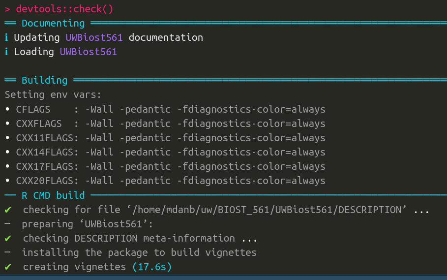
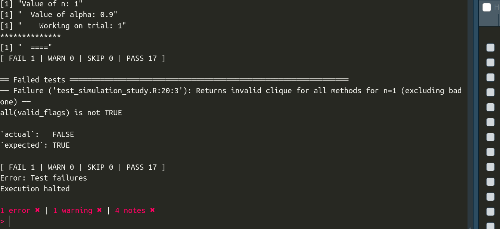

```{r setup, include = FALSE}
knitr::opts_chunk$set(
  collapse = TRUE,
  comment = "#>"
)
set.seed(10)
library(testthat)
```

# Instructions

These instructions are essential, so please read them all carefully. 

- Submit your homework on your GitHub page as the RMarkdown (`.Rmd`) and HTML files. 

- Please answer the question prompt and show your code (inline). That is,
all your code should be visible in the knitted chunks.

- To complete this homework, you may write in the `HW3.Rmd` file. 
(It is recommended to complete this homework in R Studio, where clicking the
`Knit` button would knit your homework.)

# Disclosures

- Please disclose below who you collaborated with and if you've used ChatGPT (or any
comparable AI tool) to what extent when completing this homework. See the syllabus
for the course expectations.

# Note about the homework

**Note**: Most of your R code for this homework will **not** be in this homework.
You mainly write `.R` files inside the `R` or `tests` folders.
Therefore, you only need to show a little code inside this R Markdown file.
You only need to write things inside this R Markdown file in the questions that explicitly ask you to do so.

Please use [https://docs.google.com/document/d/1369bf2WE7n2FzhFoqUv2rgWMZRurYfjHmGMUNHfOWBU/edit?usp=sharing](https://docs.google.com/document/d/1369bf2WE7n2FzhFoqUv2rgWMZRurYfjHmGMUNHfOWBU/edit?usp=sharing) as a resource for this homework.

# Code of conduct for this homework

<mark><u>**Please be respectful to your peers**</u></mark> for this homework. 
Each student's `compute_maximal_partial_clique()` function is anonymized and
being used by every other student for this homework. 
Some implementations of this function work smoother than others. 
Nonetheless, 1) please be respectful to all the implementations throughout this homework, as you might not realize you're talking to the author of an implementation, and 2) please do not feel embarrassed if you (knowing which implementation is yours, since you wrote it) does not work as well as you initially thought. 

# Q1: Doing a code review of two other implementations

<mark>**Intent**: The intent of this question is to review other implementations. This is to see how your sense of coding compares to your peers.</mark>

<mark>**Note 1**:</mark> My instructions in HW3 were unclear about how to define the density of a clique size of one (i.e., just one node) -- I (Kevin) apologize. Let's define the edge density of 1 node to be 1 (so returning a set of 1 node is always a valid clique, albeit not the largest one).

In your GitHub Issues for HW3, I have assigned each of you <u>**two**</u> `compute_maximal_partial_clique` implementations to review. For example, if you were assigned #1 and #3, you will be reviewing the implementations of 
`compute_maximal_partial_clique1()` and `compute_maximal_partial_clique3()`. 

<u>**Question 1A**</u>: We will have gone over in Lecture 8 how to install all the `compute_maximal_partial_clique` implementations into your `UWBiost561` package. In short, you will find a `zip` file on Canvas called `hw4_implementations.zip`. Download it, and unzip the file. You should see a bunch of functions under the `files-to-put-into-R-folder` folder, including a `compute_maximal_partial_clique_master.R` and many `compute_maximal_partial_clique` implementations (each as its own `.R` file).
Copy and paste <u>**all**</u> these files into your `R` folder in your `UWBiost561` package.

Once you've done both these things, run `devtools::check()` to add the documentation for all the `compute_maximal_partial_clique` functions. (If you had no warnings or errors at the completion of your HW3, you should still have no warnings or errors now.) Then, run `devtools::install()` to install your new `UWBiost561` package.
<span style="color: blue;">(There is nothing to report for this question.
You do *not* make these changes to your R Markdown file.)</span>

<u>**Question 1B**</u>: Looking at two implementations you were given, summarize what you think the implementations are doing in one to four sentences each. (This is to practice reading other people's code.)

<span style="color:red">
Both implementations start by checking that the arguments to the function are valid. Implementation 1 loops over all nodes as the "starting node" and then loops over all the other nodes, checking if adding them to the current clique preserves the condition that the edge density after adding the node is actually larger than alpha. After completing the outer loop over a given node, the algorithm then checks if the clique that was found with that given node as the starting "seed" node is the larger than those found previously, and if so, updates the largest clique to be the current one. In the case of implementation 7, the code first checks the graph is fully disconnected, in which case it returns just the first node. Otherwise, it picks the row with the most consecutive "1s", and gets the corresponding clique along with its edge density. 
</span>


<u>**Question 1C**</u>: In terms of <u>**coding clarity**</u> (i.e., <u>**not**</u> whether the code gives a good answer), are there recommendations you would give the original author of the code to improve their code's clarity? This can be in documentation, variable naming, whether some code could have been factorized into their dedicated functions, if some portion of code was hard to understand, etc. Give none to two suggestions for each implementation. (You can give no suggestions if you thought the code was spectacular -- even if it's not returning a great answer, you can easily understand what the code does despite being written by someone else.)

<span style="color:red">
Implementation 1 was quite easy to understand and well-commented. It was a bit more difficult to understand implementation 7, and would have been helpful to have comments explaining the logic of its solution.     
</span>

<u>**Question 1D**</u>: In HW3, you wrote down at least 5 unit tests for your implementation of `compute_maximal_partial_clique()`. <u>**In this R Markdown file**</u> (i.e., not in your `tests` folder), copy-paste your 5 unit tests and see if the two `compute_maximal_partial_clique` implementations you were assigned pass your unit tests. If you were assigned implementations #2 and #7, you would test the functions `compute_maximal_partial_clique2()` and `compute_maximal_partial_clique7()`.

Note 1: If you have more than 5 unit tests, you only need to try 5 for this question. Since you're testing two implementations, you'll have 10 unit tests total.

Note 2: When copy-pasting your unit tests, you can directly copy-paste the entire `testthat()` function into this R Markdown file the contents of the `testthat()`. (See the example below in the R Markdown file itself. Here, you can either use `library(testthat)` in the R Markdown file or prefix your `test_that()` and other functions with `testthat::`.)

```{r, error = TRUE}
test_that("A test that passes", {
  x = 10
  expect_true(x == 10)
})

test_that("A test that fails", {
  x = 10
  expect_true(x != 10)
})
```

Note 3: You can write two large R code chunks, one for each implementation's 5 unit tests. Since the implementation you've been assigned might not necessarily pass your unit tests, please set the `error = TRUE` flag in your R code chunk options. (See the example below in the R Markdown file itself.)

```{r, error = TRUE}
library(testthat)
test_that("compute_maximal_partial_clique1 outputs something that is the correct type", {
  
  mat <- UWBiost561::generate_partial_clique(n = 10,
                                 clique_fraction = 0.5,
                                 clique_edge_density = 0.9,
                                 seed=42)
  result <- UWBiost561::compute_maximal_partial_clique1(adj_mat = mat$adj_mat, alpha = 0.6)
  
  expect_type(result, "list")
  expect_true(all(c("clique_idx", "edge_density") %in% names(result)))
  expect_type(result$clique_idx, "integer")
  expect_true(all(result$clique_idx %% 1 == 0))
})

test_that("compute_maximal_partial_clique1 outputs something that is within the correct range", {
  mat <- UWBiost561::generate_partial_clique(n = 10,
                                 clique_fraction = 0.5,
                                 clique_edge_density = 0.9,
                                 seed=42)
  result <- UWBiost561::compute_maximal_partial_clique1(adj_mat = mat$adj_mat, alpha = 0.6)
  
  expect_true(all(result$clique_idx >= 1 & result$clique_idx <= nrow(mat$adj_mat)))
  expect_true(result$edge_density >= 0 && result$edge_density <= 1)
})

test_that("compute_maximal_partial_clique1 handles corner case of disconnected graph", {
  mat <- UWBiost561::generate_partial_clique(n = 10,
                                 clique_fraction = 0.5,
                                 clique_edge_density = 0,
                                 seed=42)
  
  result <- UWBiost561::compute_maximal_partial_clique1(adj_mat = mat$adj_mat, alpha = 0.5)
  
  expect_true(result$clique_idx == 1 & result$edge_density == 1)
})

test_that("compute_maximal_partial_clique1 gets the correct answer when changing the graph without changing the expected clique", {
  mat <- UWBiost561::generate_partial_clique(n = 10,
                                 clique_fraction = 0.7,
                                 clique_edge_density = 0.9,
                                 seed=42)
  result1 <- UWBiost561::compute_maximal_partial_clique1(adj_mat = mat$adj_mat, alpha = 0.6)
  
  mat$adj_mat[8,10] = 0
  mat$adj_mat[10,8] = 0
  
  result2 <- UWBiost561::compute_maximal_partial_clique1(adj_mat = mat$adj_mat, alpha = 0.6)
  
  expect_true(all(result1$clique_idx == result2$clique_idx))
})

test_that("compute_maximal_partial_clique1 gets the correct answer for carefully crafted problem with two cliques of different sizes", {
  n <- 5
  adj_matrix <- matrix(0, nrow = n, ncol = n)
  adj_matrix[1:3, 1:3] <- 1
  adj_matrix[4:5, 4:5] <- 1
  result <- UWBiost561::compute_maximal_partial_clique(adj_mat = adj_matrix, alpha = 0.9)
  expect_true(all(result$clique_idx == c(1,2,3)))
})

#####
test_that("compute_maximal_partial_clique7 outputs something that is the correct type", {
  
  mat <- UWBiost561::generate_partial_clique(n = 10,
                                 clique_fraction = 0.5,
                                 clique_edge_density = 0.9,
                                 seed=42)
  result <- UWBiost561::compute_maximal_partial_clique7(adj_mat = mat$adj_mat, alpha = 0.6)
  
  expect_type(result, "list")
  expect_true(all(c("clique_idx", "edge_density") %in% names(result)))
  expect_type(result$clique_idx, "integer")
  expect_true(all(result$clique_idx %% 1 == 0))
})

test_that("compute_maximal_partial_clique7 outputs something that is within the correct range", {
  mat <- UWBiost561::generate_partial_clique(n = 10,
                                 clique_fraction = 0.5,
                                 clique_edge_density = 0.9,
                                 seed=42)
  result <- UWBiost561::compute_maximal_partial_clique7(adj_mat = mat$adj_mat, alpha = 0.6)
  
  expect_true(all(result$clique_idx >= 1 & result$clique_idx <= nrow(mat$adj_mat)))
  expect_true(result$edge_density >= 0 && result$edge_density <= 1)
})

test_that("compute_maximal_partial_clique7 handles corner case of disconnected graph", {
  mat <- UWBiost561::generate_partial_clique(n = 10,
                                 clique_fraction = 0.5,
                                 clique_edge_density = 0,
                                 seed=42)
  
  result <- UWBiost561::compute_maximal_partial_clique7(adj_mat = mat$adj_mat, alpha = 0.5)
  
  expect_true(result$clique_idx == 1 & result$edge_density == 1)
})

test_that("compute_maximal_partial_clique7 gets the correct answer when changing the graph without changing the expected clique", {
  mat <- UWBiost561::generate_partial_clique(n = 10,
                                 clique_fraction = 0.7,
                                 clique_edge_density = 0.9,
                                 seed=42)
  result1 <- UWBiost561::compute_maximal_partial_clique7(adj_mat = mat$adj_mat, alpha = 0.6)
  
  mat$adj_mat[8,10] = 0
  mat$adj_mat[10,8] = 0
  
  result2 <- UWBiost561::compute_maximal_partial_clique7(adj_mat = mat$adj_mat, alpha = 0.6)
  
  expect_true(all(result1$clique_idx == result2$clique_idx))
})

test_that("compute_maximal_partial_clique7 gets the correct answer for carefully crafted problem with two cliques of different sizes", {
  n <- 5
  adj_matrix <- matrix(0, nrow = n, ncol = n)
  adj_matrix[1:3, 1:3] <- 1
  adj_matrix[4:5, 4:5] <- 1
  result <- UWBiost561::compute_maximal_partial_clique7(adj_mat = adj_matrix, alpha = 0.9)
  expect_true(all(result$clique_idx == c(1,2,3)))
})
```

Note 4: If you would like to test for things that weren't in your HW3, feel free to do so. (Your tests for this question don't literally need to be the same ones you created for HW3.)

# Q2: Constructing a simulation study

<mark>**Intent**: The intent of this question is to construct a simulation study that you'll run on Bayes.</mark>

In this question, you'll be designing a simulation. You will be doing this on Bayes for a couple of reasons: 1) To give you experience running code on Bayes, and 2) because your simulations might take a couple of hours to run.

Note: inside the file `compute_maximal_partial_clique_master.R` (which should now be in your `R` folder), I've provided you two functions: `compute_maximal_partial_clique_master()` and `compute_correct_density()`. You will find both functions useful for Q2 and Q3.

<u>**Question 2A**</u>: Please run the following code. If you cannot run it, something has gone wrong with your `UWBiost561` package. (For instance, it might be because your `generate_partial_clique()` function does not work or is not correctly located in your R package.)

```{r, eval = FALSE}
library(UWBiost561)
set.seed(10)
data <- UWBiost561::generate_partial_clique(n = 10, 
                                            clique_fraction = 0.5,
                                            clique_edge_density = 0.95)

set.seed(10)
result1 <- UWBiost561::compute_maximal_partial_clique_master(
  adj_mat = data$adj_mat, 
  alpha = 0.95, 
  number = 11, 
  time_limit = 30
)
result1

set.seed(10)
result2 <- UWBiost561::compute_maximal_partial_clique11(
  adj_mat = data$adj_mat, 
  alpha = 0.95
)
result2
```

As you can see, the `compute_maximal_partial_clique_master()` function: 1) takes a `number` argument (which allows you to control which implementation of `compute_maximal_partial_clique` you're using) and 2) sets a timer (here, of 30 seconds)
so that the function terminates in at most 30 seconds.

Using the provided code as a framework, use the `compute_maximal_partial_clique_master()` with a setting of `time_limit` such that the function terminates prematurely, i.e., `time_limit` is set to be a small number. (That is, if, hypothetically, the function required 40 seconds to complete, but you set `time_limit` to only be 30 seconds.) By changing the ' number ' argument, you can use any implementation of `compute_maximal_partial_clique` you prefer for this question.

Note: For this question, you want to generate an adjacency matrix where `n` is large (i.e., a value close to 50), but `time_limit` is very small (i.e., just a few seconds). You deliberately want to cause a `timed_out` status.

```{r, eval = FALSE}
library(UWBiost561)
set.seed(10)
data <- UWBiost561::generate_partial_clique(n = 50, 
                                            clique_fraction = 0.5,
                                            clique_edge_density = 0.95)

set.seed(10)
result1 <- UWBiost561::compute_maximal_partial_clique_master(
  adj_mat = data$adj_mat, 
  alpha = 0.95, 
  number = 11, 
  time_limit = 30
)
result1
```

<u>**Question 2B**</u>: Describe what you would like your simulation to study in a few sentences. Specifically, you are making a <u>**simulation plan**</u> (see Lecture 8 for details).

Your plan should answer the following questions:

- 1) How are you generating the random graphs for your analysis? What qualities do those random graphs have? (You can use your `generate_partial_clique()` function, and then you would describe what kind of graph your `generate_partial_clique()` makes.)
- 2) How are you varying the random graphs across the different "levels" of your analysis? (For example, you can vary `n`, `clique_fraction`, `clique_edge_density`, and/or `alpha`. Your simulation study can focus on changing one or two values.)
- 3) Which different methods are you using in your simulation study? (This question is moot for this homework since you'll be using all 15 implementations of `compute_maximal_partial_clique`, but please write this down for thoroughness.)
- 4) What do you hope to learn with your simulation study? Alternatively, what trends/patterns/results are you hoping to see?
- 5) How many trials do you intend to run per "level"?
- 6) How much time do you estimate your simulation study will need at maximum? See Note 2 below.

The only hard requirements I am imposing for this simulation study are:

- You **<u>must</u>** use all 15 implementations of `compute_maximal_partial_clique` in your simulation study, where each method is used on every adjacency matrix you generate.
- Your simulation study must have at least 2 different levels, and at least 2 trials for each level. 
- If you are choosing to vary `n` (the number of nodes), the largest `n` you consider in your simulation study is `n=50`.
- Please use `compute_maximal_partial_clique_master()` when using each of the 15 implementations (instead of calling the `compute_maximal_partial_clique` implementations directly). Additionally, please do not set `time_limit` to be larger than 30 (i.e., regardless of large your simulation study gets, please do not allow more than 1 minute for any implementation). There are 15 implementations, and I wouldn't want just one trial to take more than 15 minutes!
- <mark>Your simulation study should take <u>**less than 5 hours**</u> to run to completion on a single core (i.e., not parallelized). See Note 2 below.</mark>

Some ideas of what you can test for is: how often does each method get the maximal partial clique (among all 15 methods) when the number of nodes `n` changes, or when `alpha` changes? You can also try incorporating how fast an implementation is (in terms of time) into your simulation study.

Feel free to post on Canvas Discussions your thoughts on the simulation study if you are unsure about your simulation study. 

Note 1: If you choose to vary `n` in your simulation study, a value of `n` of 30 or more will make your simulation take a long time to finish. 

Note 2: You will use the `compute_maximal_partial_clique_master()`, which can time a function out after a `time_limit` number of seconds (by default, 30 seconds). Therefore, the number of problem instances you will solve is, roughly speaking, (the number of levels) x (the number of methods) x (the number of trials per level), and the maximum time your simulation would need would be (the number of levels) x (the number of methods) x (the number of trials per level) x 30 seconds. 

Note 3: Please design a straightforward or complicated simulation study appropriate to your comfort in coding. If you are overwhelmed by this homework, you can code a simulation study that only takes a few minutes to complete. (You can use the demo in class as a rough skeleton for your simulation study. Of course, you can design your own way to perform a simulation study as well.)

Note 4: For the simulation study, you will (of course) need to generate random adjacency matrices. You can use the `generate_partial_clique()` you already created for HW3, but you can also modify `generate_partial_clique()` to better suit your simulation study's goals.

Note 5: If you feel overwhelmed, you can more-or-less plan a simulation study that is very similar to the demo done in class (Lecture 8). Specifically, inside the `hw4_implementations.zip`, there are files `hw4-demo_bayes_execute.R`, `hw4-demo_bayes_execute.slurm`, and ``hw4-demo_bayes_plot.R` that effectively tell you how to do a specific simulation study. Feel free to use these scripts as closely as you want for your simulation study. (However, you would still need to make a simulation function and follow the guidelines still. There is still some non-trivial work you would still need to do.)

<span style="color: blue;">(This is a writing question, not a coding question.)</span>

<ol style="color:red">
  <li>How are you generating the random graphs for your analysis? What qualities do those random graphs have? (You can use your <code>generate_partial_clique()</code> function, and then you would describe what kind of graph your <code>generate_partial_clique()</code> makes.)
  
  I'm using `generate_partial_clique()` with high clique fraction and clique edge density (set constant at 0.9)
  
  </li>
  <li>How are you varying the random graphs across the different "levels" of your analysis? (For example, you can vary <code>n</code>, <code>clique_fraction</code>, <code>clique_edge_density</code>, and/or <code>alpha</code>. Your simulation study can focus on changing one or two values.)
  
  I'm varying n and alpha (n=10,15,20 and alpha=0.5,0.75,0.9)
  
  </li>
  <li>Which different methods are you using in your simulation study? (This question is moot for this homework since you'll be using all 15 implementations of <code>compute_maximal_partial_clique</code>, but please write this down for thoroughness.)
  
  All 15 different implementations of `compute_maximal_partial_clique`
  
  </li>
  <li>What do you hope to learn with your simulation study? Alternatively, what trends/patterns/results are you hoping to see?
  I'm interested in seeing whether different values of n and alpha change the results dramatically across different methods.
  
  </li>
  <li>How many trials do you intend to run per "level"?
  
  3 trials per level
  
  </li>
  <li>How much time do you estimate your simulation study will need at maximum? See Note 2 below.
  
  2 levels x 15 methods x 3 trials/level x 30 seconds = 2700 seconds = 45 minutes
  
  </li>
</ol>


<u>**Question 2C**</u>: In your `R` folder, design a function that executes your intended simulation plan. (I am purposely being loose and very open-ended about designing this simulation regarding the inputs or outputs. In contrast to HW3, where everything was spelled out explicitly, I am now giving you the task of meaningfully designing the inputs/outputs.)

Note 1: You want to use `compute_maximal_partial_clique_master()` in your simulation. This would make your life easier when switching between different implementations. The main difficulties in this question are: 

- 1) How to extract and store the results of `compute_maximal_partial_clique_master()`
- 2) How do you decide what meaningful outputs your simulation function should return (for example, you probably don't need to return the `adj_mat` adjacency matrices themselves)? This will highly depend on what your simulation plan is trying to study!
- 3) How to handle the instances when `compute_maximal_partial_clique_master()`: A) times out, B) errors, or C) outputs an alleged `clique_idx` that is invalid because it doesn't form a partial clique with edge density `alpha` or larger.

Note 2: Be aware -- you should be a healthy skeptic when using other people's code in a simulation. Just because a method claims it found a partial clique, you should verify that it is indeed a partial clique with edge density larger than `alpha`. You might want to use the `compute_correct_density()` function provided in `compute_maximal_partial_clique_master.R`.

Note 3: I am asking you to make a <u>**function**</u> to perform your simulation (instead of just an R script) since I will be asking you to test your simulation function in Question 2D below.

Note 4: You should allow your simulation function to take as input the different levels of your simulation study and the number of trials (and other parameters of your choosing). That way, you can more easily "test" a "simple" simulation study in Question 2D below.

Note 5: You (ideally) want to set up your simulation such that for each trial in a level, you generate <u>**one**</u> random adjacency matrix that is used in <u>**all 15**</u> different implementations of `compute_maximal_partial_clique`. This gives a "fair" comparison across all 15 methods. You also might want to set the random seed (via `set.seed()`) before generating that random adjacency matrix for this trial so you can easily reproduce the results from a particular trial if needed.

Note 6: This question is the hardest part of HW4. Since this question is purposely more open-ended, it is harder to use ChatGPT to help you with this function. However, most of your future coding experiences will be open-ended, so practicing "coding with ChatGPT" in more unstructured settings is good. I encourage you to work with your classmates on this question (but, as per our syllabus rules, do not directly copy your classmate's code).

<span style="color: blue;">(There is nothing to report for this question. Your code will be in the `R` folder, **not**
in this R Markdown file.)</span>

<u>**Question 2D**</u>: Create a few (more than one) unit tests for your simulation function. This unit test (like your unit tests in HW3) will be in your `tests/testthat` folder. I am also purposely vague about how many tests or what kind of unit tests to write. This is for you to decide! After all, you're about to unleash your code to perform a (potentially long) simulation test, so you hope you've tested your simulation code well enough for this to be a good use of time.

Note: Your unit tests should be <u>**fast**</u> (i.e., take no more than a minute to run). This means your unit tests should <u>**not**</u> be performing your complete simulation study. After all, it'll be a useless unit test if it takes an hour to figure out if your unit test passed. However, you want your unit tests (which take less than a minute) to give you confidence that your code will work when running the complete simulation study (which might take more than an hour).

<span style="color: blue;">(There is nothing to report for this question. Your code will be in the `tests/testthat` folder, **not**
in this R Markdown file.)</span>

<u>**Question 2E**</u>: Similar to what you did in HW3, please include a screenshot of your output after running `devtools::check()`. You should still have a `UWBiost561` package
that passes all the checks and your unit tests.
(As a guideline, one screenshot should show the first 20-or-so lines of your 
`devtools::check()` results, and a second screenshot should show the last 
20-or-so lines of your results.) You can use the `knitr::include_graphics()` function to include
figures inside this R Markdown file.

The intent of this question is to provide "evidence" that your `devtools::check()`
went smoothly. You do not need to worry about what your screenshots show specifically.

```{r}


```

# Q3: Performing the simulation study

<mark>**Intent**: The intent of this question is to perform the simulation study and to practice visualizing simulation results.</mark>

Now that you've written a function to perform your simulation study, you want to write more code to perform the actual simulation study. This will technically involve at least 3 new files in your `vignettes` folder: one `.R` file to perform the simulation study, one accompanying `.slurm` script to submit those above `.R` file to Bayes, and one `.R` file to load the simulation results and visualize the results. The following questions will guide you through these three files.

<u>**Question 3A**</u>: In your `vignettes` folder, make a file called `HW4_simulation_execute.R`, which will be a R script that: 1) loads your `UWBiost561` package, and 2) executes your simulation function inside your `UWBiost561` package.
This simulation will be the "full" simulation study you outlined in Question 2B above.
(This is the specific `.R` file that might take a couple of hours to finish, depending on how complex your simulation study is.) The end of your `HW4_simulation_execute.R` should save your simulation results as `HW4_simulation.RData`, an `.RData` file. (For example, the argument to the `save()` function could be `file = ~/HW4_simulation.RData`. This would save the results to a `HW4_simulation.RData` file under your home directory on Bayes.) 

Then, make an accompanying `HW4_simulation_execute.slurm` that submits your `HW4_simulation_execute.R` as a job to Bayes. Please limit yourself to `10gb` of memory (i.e., a line in `HW4_simulation_execute.slurm` should read `#SBATCH --mem-per-cpu=10gb`). (Your simulation study should not require more than 10 Gigabytes of memory. If it does, you are likely not being practical in your simulation study.)

<span style="color: blue;">(There is nothing to report for this question. Your code will be in the `vignettes` folder, **not**
in this R Markdown file.)</span>

See Lectures 7 and 8 for more details on how to do this.

<u>**Question 3B**</u>: Now, install your `UWBiost561` package in R. Lecture 8 and [https://docs.google.com/document/d/1369bf2WE7n2FzhFoqUv2rgWMZRurYfjHmGMUNHfOWBU/edit?usp=sharing](https://docs.google.com/document/d/1369bf2WE7n2FzhFoqUv2rgWMZRurYfjHmGMUNHfOWBU/edit?usp=sharing) will give you a few options on how to install your `UWBiost561` package on Bayes.

<span style="color: blue;">(There is nothing to report for this question.)</span>

<u>**Question 3C**</u>: Now, run your simulation study. In the terminal, this means you will 1) navigate to your `UWBiost561/vignettes` folder on Bayes (this might be something like `cd ~/UWBiost561/vignettes`) and 2) run the command: `sbatch HW4_simulation_execute.slurm`.

Note 1: This question might cause you pain since you might not know if your script is working as intended. (Additionally, suppose you did not test your simulation function thoroughly. In that case, your `HW4_simulation_execute.slurm` script might crash, and you'll be forced to debug your `UWBiost561` package and re-install it, etc. It's a pain. Trust me, you want to test your simulation function thoroughly before you do this Question.)

<mark><u>**Note 2:**</u> Do <u>**not**</u> parallelize your simulation across multiple cores or write a batch SLURM script to submit multiple jobs for this question. (Many of you will likely be working on the homework at similar times, and I cannot guarantee that the server can allow an entire course of students to submit parallelized jobs simultaneously.) If this note does not make any sense to you, don't worry about it.</mark>

<span style="color: blue;">(There is nothing to report for this question. You are simply running your `HW4_simulation_execute.slurm` file.)</span>

<u>**Question 3D**</u>: Finally, create a file called `HW4_simulation_plot.R` under the `vignettes` folder. You will design this script to load your saved results in `HW4_simulation.RData`, visualize the results, and save the plot into your `vignettes` folder. Name this one plot as `HW4_simulation.png`. (You can save your plot in a different file format, but `.png` is the easiest one to work with.)

How complicated should this script be? It depends on the results you saved in `HW4_simulation.RData`. For example, if you saved the clique size of each method in each trial for each level, then you might need to compute the average clique size across all the trials for each level in this script. 

What should you plot? It depends on what your simulation plan was intended to study (which you wrote in Question 2B). I'm leaving this open-ended so you can practice determining how best to demonstrate the results you're trying to study. 

Note 1: You can run your `HW4_simulation_plot.R` script <u>**interactively**</u> on Bayes. You do not need to write a `.slurm` script for this if you prefer not to (since your entire `HW4_simulation_plot.R` script should take only a few minutes to run. After all, you're simply loading in and plotting the results. There shouldn't be any very fancy computation being performed in this script, and indeed, you shouldn't be computing any maximal partial cliques in this script).

Note 2: Feel free to consult [https://r-graph-gallery.com/](https://r-graph-gallery.com/) to get ideas on how to meaningfully visualize your results.

<span style="color: blue;">(There is nothing to report for this question. Your code will be in the `vignettes` folder, **not**
in this R Markdown file.)</span>

<u>**Question 3E**</u>: Now, on Bayes, there should be at least four new files in the `vignettes` folder due to Question 3A-3D: `HW4_simulation_execute.R`, `HW4_simulation_execute.slurm`, `HW4_simulation_plot.R`, and `HW4_simulation.png`. (There might be many other files, but I am okay with it if there are more files than needed.) Commit and push all these files via Git (using the command line on Bayes) onto GitHub.com (via `git push`), and then pull all these files via Git onto your local laptop. (You can pull either through the command line via `git pull` or the RStudio GUI.)

Finally, include your plot in this R Markdown file. (I'm having you put your plot in your `vignettes` folder and push/pull your `UWBiost561` package because I'm assuming you knit this `HW4.Rmd` file locally on your laptop, but you need to somehow get your plot from Bayes onto your local laptop.)

# Q4: Describing your final project

<mark>**Intent**: The intent of this question is to make sure you have a plan for the final project.</mark>

I will release the final project specifications (again, which involve making a PkgDown website of any R package of your choosing of any scope) on Canvas. This will be released (at the latest) by May 25th.

Please write (in one to five sentences) what you are thinking of doing for your final project. If your answer hasn't changed since HW3, you can copy-paste your answer from HW3 into this question for HW4.

<span style="color:red">
I will expand the `UWBiost561` package. 
</span>

# Q5: Feedback (Optional)

This "question" is an additional way for students to communicate with instructors. 
You could include positive feedback about topics you enjoyed learning in this module, critiques about 
the course difficulty/pacing, 
or some questions/confusions you had about course material.
Your feedback can help shape the course for the rest of this quarter and 
future years. Please be mindful and polite when providing feedback.
You may leave this question blank.


